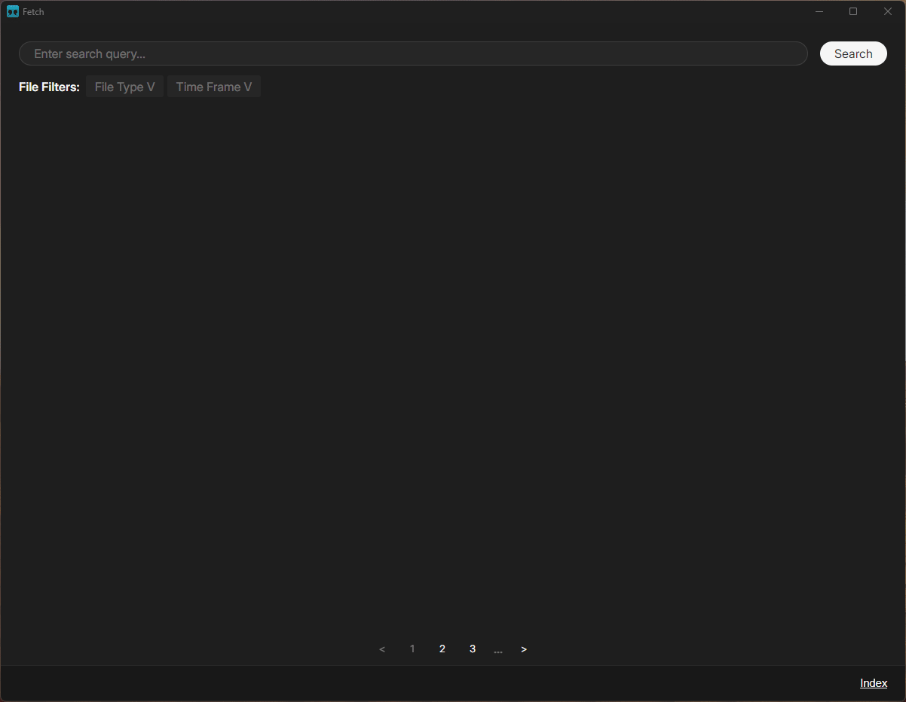
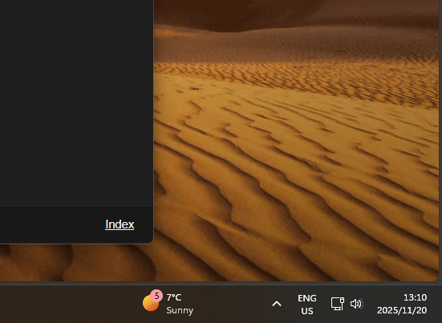

# Fetch

A file search application that utilizes locally generated semantic vector embeddings to supplement searches with the actual content of the files themselves. Use AI to search through your files, completely and purely on your personal machine!

If this application was useful or interesting to you, please consider giving it a star! ⭐

## Quick Start

To get started with Fetch, download the appropriate installer for your operating system in the [latest release](https://github.com/august99us/fetch/releases/latest) on the right and run. The installer will guide you through the necessary steps.

Index some data using the index pane in the GUI. Note: If you want to index a very large folder, currently it will likely be better if you use the [CLI](#cli), it is more stable.



Then get to searching!


Press Ctrl(or Cmd)+Shift+Space to search quickly from anywhere.


Fetch enables this quick search shortcut by living in your tray. This also helps it keep the neural networks warm, and perform automatic indexing as your files change (in the future!). The downside of this is that Fetch will take 2GB~ish of memory. In the future, this will be more configurable. For now, if you want to fully exit Fetch, use the tray icon!



You can then boot up Fetch again any time you need to search or index files.

If these installers do not work for you, or you would like to customize your installation (maybe with custom builds of ONNXRuntime or such) you can follow the steps in the [Building from source](#building-from-source) section to build from source.

If you have previously installed an earlier version of Fetch, you may need to clear the application data directory in order for the application to work if the database schemas and/or configuration files have changed since the previously installed release. If your application crashes on startup or as soon as you do any indexing/querying, then this is probably the issue. See [Settings and Application Data](#settings-and-application-data) for more details.

### Early Alpha Software Warning

Caution: Fetch is currently in very very early alpha phase.

While I will try to provide as much tooling and how-tos and graphical interfaces I can, expect that you will probably eventually have to get your hands wet and interact with the command line and installed files directly at some point if you continue using the application. 

Expect that while the application's backend is still evolving quickly, you will likely have to completely delete and regenerate your indexes on each version update. Note that these aforementioned indexes are purely Fetch-related application data files. Fetch will never touch or edit your original files themselves, only read them to create indexes for searching. All this will *only* ever happen on your local hardware and will never reach the internet.

Expect that while your data will never touch the internet, you may have to download application files (model files (.onnx, .onnx_data), dynamic libraries (.dll, .so, .dylib)) from the internet and insert them into your installation location manually in order to get certain features working. Most of those will probably also be written by me and open source, I will provide links to those and guarantees for that functionality on this page here. Any other plugins or model files you download and insert into the application will be at your own risk.

## Features

Fetch allows users to search files by many means - filename, semantic content, created/modified dates, text matching. In order to do this at scale, it must first read and process these files to extract and record this information. This process is called indexing, and effectively performs a pivot on the data to structure it by the searchable aspects instead of the original data structure. Think of the Index section in a dictionary or a text book - instead of structuring the data by page number -> topic, we reorganize the data by topic and list the relevant page numbers for that topic.

In accordance with this, Fetch provides two main features - 1) Indexing, and 2) Querying. Indexing takes in a set of files or folders, and performs this pivot operation on all the files found in that set, including recursively searching through the folders. These generated pivot structure, or "index" is then saved in a database. Querying then performs matching against all the generated indexes, returning a score for how well each index record matches the query and returning the top scoring records. Note that a single logical record (a specific file, in this case), may have multiple actual index records - one for each searchable aspect of the file. For example, the semantically processed content of the file represents one searchable aspect. The filename, another, which may be matched against the full text or the phrases in the query. The location the file was created, another. When multiple index records exist for a single logical record like this, the scores are combined in a fashion that takes into account all of the scores before then being used to rank the logical record for display.

Fetch allows users to index in three different ways:

1) Through a batch job in the GUI. This is done by starting the full Fetch application, then opening the index drawer on the bottom of the screen, selecting the appropriate files and folders, and then clicking the Index button. Results will be shown in the bottom text display as they are created.
2) Through a batch job using the CLI. This is done by calling the fetch binary with the index operation, and then the files to be indexed after. An example command on windows would be: `fetch.exe index -r D:\Documents D:\Pictures D:\Other\document.pdf C:\Users\august99us\Documents\video.mp3`. The -r or --recursive flag signifies that Fetch should recursively go through given folders to find files. Further documentation on the CLI will be provided in the future.
3) Automatically, as files are created under a pre-specified set of directories. This is currently under construction. Fetch provides a low priority daemon service called fetch-daemon that will monitor a pre-defined set of directories in the file system, looking for changes to files under those directories. If a file is created, it will create the necessary index records. If a file is modified, it will update those index records. If a file is deleted, it will remove the relevant index records. This is all done automatically, as soon as one of these events is received.

Fetch allows users to query in three different ways:

1) Through the full GUI. This is done by opening the full Fetch application and performing a query. Results will be shown on the screen with previews as they are aggregated against their index records. Results can be double clicked to be opened in their default applications.
2) Through the quick search GUI. This is done by right clicking the tray icon and clicking Fetch, or by pressing `Ctrl+Shift+Space`, or `Cmd+Shift+Space` on macOS. Results will be aggregated as the user types, and can be opened by pressing the Enter key. The result's file location can be opened instead by pressing Shift+Enter.
3) Through the CLI. This is done by calling the fetch binary with the query operation, and then the query after. An example command on windows would be: `fetch.exe query "a picture of my dog"`. Further documentation on the CLI will be provided in the future.

Fetch provides many searchable aspects by default. The specific searchable aspects that are available for a file may vary depending on the file type. Here is a general list of searchable aspects that I aim to provide:

1) Full and partial text matching by file name (Currently under testing)
2) Semantic matching based on the semantic meaning of the query and the semantic content of the file
3) Full and partial text matching by file text content (Currently under testing)
4) Full and partial text matching on tags applied to the file (Under construction)
5) Filtering based on creation and modified dates (Under construction)
6) Filtering based on containing directory
7) Possibly more in the future...

A lot of these aspects are currently under tuning, and may overly influence search rankings. I will aim to adjust this as best as possible.

## Semantic Search

Semantic search is the ability to search file content by what it means and/or represents, rather than an exact or fuzzy match. This means that the query "a cat", for example, will match anything that contains something about a cat - whether it is a picture of a cat, a passage describing a cat, a sound that a cat makes, or a video of a cat. Fetch achieves this by embedding the content of the file as a vector using a neural network. Fetch then embeds the query as a vector as well at query time, and then compares these two vectors using cosine similarity. The neural network is specifically trained to embed concepts similarly to each other.

### Chunking for Semantic Search

Sometimes documents are too large for a model to process and generate meaningful embeddings for. A vector is a limited information storage space, so embedding an entire book for example would require leaving out a lot of the nuance in the text and the individual passages itself. In cases like this, we should chunk the 

### Supported Models and File Types

Not all embedding models support all modalities of data in generating their embeddings. Models also vary largely in their hardware resource requirements, ranging from a couple megabytes in size and similar processing power requirements, to many gigabytes and professional GPU processing requirements. Because one of Fetch's goals is to run everything locally on the user's hardware so the user's data never leaves their computer, I have tried to keep resource requirements as low as possible. I have provided a current list of supported models below, as well as a table of supported data types for semantic search and how they utilize those models below that.

**Currently Supported Models:**

| Model | Provenance | Modalities | Size | Notes |
| --- | --- | --- | --- | --- |
| *[CLIP B/32](https://huggingface.co/openai/clip-vit-base-patch32)* | OpenAI | Image | ~600MB | *Notable mention: Smaller than SigLIP-2 but lacks multilingual query support* |
| [SigLIP-2 B/16-512](https://huggingface.co/google/siglip2-base-patch16-512) | Google | Image | ~1.4GB | Default model for image semantic search |
| [EmbeddingGemma 300m](https://huggingface.co/google/embeddinggemma-300m) | Google | Text | ~1.2GB | Default model for text semantic search |
| *[ImageBind](https://github.com/facebookresearch/ImageBind)* | Meta | Image, Text, Audio, Video | ~4.5GB | *Possible expansion path: More modality support at the cost of more resources* |

**File Type Support and Model Usage:**

| File Type | Semantic Search | Model Used | Text Extraction | Additional Notes |
| --- | --- | --- | --- | --- |
| Images (.jpg, .png, .webp, .psd, etc.) | ✓ | SigLIP-2 | - | Generates embeddings from image content |
| PDF | ✓ | EmbeddingGemma + SigLIP-2 | ✓ | Extracts, chunks and embeds text; processes embedded images |
| Text Files (.txt, .md, .log, etc.) | Planned | EmbeddingGemma | ✓ | Text content chunked and embedded |
| Office Docs (.docx, .xlsx, etc.) | Planned | - | Planned | Text extraction and embedding planned |
| Audio (.mp3, .wav, etc.) | Planned | - | - | Future support with ImageBind or similar |
| Video (.mp4, .avi, etc.) | Planned | - | - | Future support with ImageBind or similar |

#### Supported NN Hardware

With the increased proliferation of neural processing units and neural network chips in consumer hardware, part of Fetch's goal of providing on-device file search includes being able to support as much consumer hardware as is possible to accelerate and streamline the embedding process. This consumer hardware can provide hundreds of times faster processing speeds at a much lower power cost compared to the baseline of running these neural networks on the CPU. This increased efficiency allows these neural networks to be run on extremely constrained devices, like mobile phones.

| Hardware Type | Examples | Current Support | Notes |
| --- | --- | --- | --- |
| CPU | x86_64, ARM64 | ✓ Supported | Default execution provider, works on all platforms |
| NVIDIA GPU (CUDA) | GeForce RTX, GTX series | ✓ Testing | Requires `cuda` feature flag and CUDA-enabled ONNX Runtime. May require installed cudNN on user device. |
| Qualcomm NPU (QNN) | Snapdragon X Elite, 8 Gen series | ✓ Experimental | Requires `qnn` feature flag and custom ONNX Runtime build |
| Apple Neural Engine | M-series chips, A-series chips | Planned | CoreML execution provider integration planned |
| Intel NPU | Intel Core Ultra (Meteor Lake+) | Planned | OpenVINO execution provider integration planned |
| AMD GPU | Radeon RX series | Planned | ROCm/DirectML execution provider integration planned |

### Other Search Heuristics by File Types

TODO

## Settings and Application Data

Fetch stores settings in two different .toml files, located at `~/APPDATA_FOLDER/fetch`. The `APPDATA_FOLDER` varies depending on the user's OS. A table describing where to find this folder is provided below:

| Platform | Folder |
| --- | --- |
| Linux | `/home/<user>/.local/share/fetch` |
| macOS | `/Users/<user>/Library/Application Support/fetch` |
| Windows | `C:\Users\<user>\AppData\Local\fetch` |

The two different .toml files are described below:

| File | Purpose | Key Settings |
| --- | --- | --- |
| `data.toml` | Data storage configuration | Default directories for index data, chunks, and file previews |
| `daemon.toml` | Daemon process configuration | Watchlist file location for automatic file monitoring |

Application data is by default stored under `~/APPDATA_FOLDER/fetch/data`. This includes chunked files and index records, as well as file previews generated for the GUI. These locations can be configured, however, namely in the data.toml file.

Note that these settings and data, both structure and content are implementation details that are unstable and highly likely to change as Fetch develops and matures. These configurations are also the most likely reason why an installation of Fetch might not be working. The best thing to do in these cases is to completely delete the fetch application data folder (ie. `~/APPDATA_FOLDER/fetch`), to restore factory settings. Note that deleting the data folder will remove all index records, which means you will need to re-index your documents before you can query them again.

## CLI

Fetch provides a command-line interface bundled with the main application executable. Running the executable without any arguments launches the GUI application, while subcommands provide CLI functionality for indexing and querying.

### Usage

```bash
# Run the GUI application
fetch

# View help and available commands
fetch --help

# View help for a specific command
fetch index --help
```

### Available Commands

**`fetch index`** - Index files and folders for semantic search

```bash
# Index files and folders
fetch index /path/to/file.pdf /path/to/folder

# Recursively index all files in folders
fetch index -r /path/to/folder

# Parallel indexing with multiple jobs
fetch index -j 4 -r /path/to/folder

# Force indexing without confirmation
fetch index -f /path/to/folder

# Track and print performance metrics
fetch index -m /path/to/folder
```

Options:
- `-r, --recursive` - Recursively search through subfolders to find files to index
- `-j, --jobs <NUM>` - Number of parallel indexing jobs to run at once
- `-f, --force` - Do not confirm before indexing
- `-m, --metrics` - Track and print performance metrics

**`fetch query`** - Query the semantic file index with a text query

```bash
# Query with a search string
fetch query "a picture of my dog"

# Limit number of results
fetch query -n 10 "meeting notes from last week"

# Adjust query performance (chunks per API call)
fetch query -c 1000 "project documentation"
```

Options:
- `-n, --num-results <NUM>` - The number of file results to return
- `-c, --chunks-per-query <NUM>` - The number of chunks to query per API call (higher = faster but more memory)

**`fetch query-by-file`** - Query the semantic file index using a file (e.g., find similar images). Experimental API that only accepts images and returns images.

```bash
# Find files similar to a query file
fetch query-by-file /path/to/image.jpg

# Limit number of results
fetch query-by-file -n 5 /path/to/image.jpg
```

Options:
- `-n, --num-results <NUM>` - The number of file results to return

**`fetch drop`** - Drop entire database table (development use only)

```bash
# Drop a specific table from the index
fetch drop /path/to/data/directory table_name
```

⚠️ **Warning**: This command is intended for development use and will permanently delete index data.

## Building from source

### Prerequisites

1. **Install Rust and Cargo**: Visit [https://rustup.rs/](https://rustup.rs/) and follow the installation instructions
2. **Install Node.js**: Version 20 or later (required for the Tauri frontend)
3. **Install Protocol Buffers compiler (protoc)**: Required for building certain dependencies

### Quick Start

```bash
# Clone the repository
git clone https://github.com/august99us/fetch.git
cd fetch

# Install frontend dependencies
cd fetch-tauri
npm install

# Run in development mode
npm run dev
```

This will start the development server and launch the Fetch GUI application.

### Feature Flags

Fetch supports several optional feature flags that can be enabled during compilation:

| Feature | Description | Default | Notes |
| --- | --- | --- | --- |
| `pdf` | PDF file parsing support | ✓ Enabled | Uses Google's PDFium library |
| `psd` | Adobe Photoshop file support | ✓ Enabled | Parses PSD files for indexing |
| `cuda` | NVIDIA CUDA acceleration | Disabled | Enables GPU-accelerated inference via CUDA |
| `qnn` | Qualcomm QNN acceleration | Disabled | Requires custom ONNX Runtime build |

To build with specific features:

```bash
# Build with CUDA support
cd fetch-tauri
npm run tauri build -- --features cuda

# Build without PDF support (disable default features)
npm run tauri build -- --no-default-features --features psd
```

### Dynamic Library Management

Fetch attempts to automatically download required dynamic libraries (ONNX Runtime, PDFium) with the correct required features (Cuda, QNN) during the build process. However, you can provide custom builds using environment variables:

#### Environment Variables

**ONNX Runtime:**
- `ONNX_BUILD_PATH`: Path to a custom ONNX Runtime build directory. The build system will recursively search this directory for the required libraries and copy them to the bundle.
- `ONNX_RELEASE_VERSION_DOWNLOAD`: Specify a particular ONNX Runtime version to download (e.g., `1.20.0`)

**PDFium:**
- `PDFIUM_BUILD_PATH`: Path to a custom PDFium build directory
- `PDFIUM_RELEASE_VERSION_DOWNLOAD`: Specify a particular PDFium version to download (e.g., `chromium/7520`)

#### Example: Using Custom ONNX Runtime

```bash
# Set the path to your custom ONNX Runtime build
export ONNX_BUILD_PATH=/path/to/onnxruntime/build/Linux/Release

# Build Fetch - it will use your custom ONNX Runtime instead of downloading
cd fetch-tauri
npm run tauri build
```

#### Automatic Download

If environment variables are not set, the build system will:
1. Check if libraries already exist in `fetch-core/bundle/`
2. If not present, download the appropriate pre-built libraries for your platform
3. Extract only the required `.dll`, `.so`, or `.dylib` files
4. Place them in the bundle directory for packaging

### NN Models in Development vs Release Builds

Because the model files are so big, the build process handles ML model files differently depending on the build profile:

#### Models Folder Structure

Models are expected to be located in `fetch-core/bundle/models/` with each model in its own subdirectory:

```
fetch-core/bundle/
└── models/
    ├── siglip2-base-patch16-512/
    │   ├── model.onnx
    │   ├── model.onnx_data
    │   └── ... (other model files)
    └── embeddinggemma-300m/
        ├── model.onnx
        ├── model.onnx_data
        ├── tokenizer.json
        └── ... (other model files)
```

Each model directory contains specific files required by Fetch to run the model. Both Siglip and EmbeddingGemma are currently downloaded from their respective fetch version huggingface repositories. The build system downloads complete model repositories and places them in these subdirectories, preserving the original structure.

#### Development Builds

Debug builds automatically download embedding models from Hugging Face during compilation:

```bash
# Models are automatically downloaded to fetch-core/bundle/models/
npm run dev
```

This ensures local development environments work out of the box without manual model management. I have encountered issues where the fetch-tauri package is built while models are still being downloaded for the fetch-core package. In cases like these, rerunning the npm command generally will be successful.

#### Release Builds

Release builds skip automatic model downloading. Instead, models are managed through different mechanisms depending on the platform:

**macOS and Linux:**
- CI/CD workflows download models from Hugging Face before building
- Models are placed in `fetch-core/bundle/models/`
- The build process includes them in the final application bundle

**Windows:**
- Models are NOT included in the MSI installer because their size would break light.exe
- A separate model download step runs in the CI/CD pipeline after building
- Models and the MSI are packaged together in a ZIP file
- During installation, a custom WiX action copies models to the installation directory
- During uninstallation, the same WiX action removes the model files

To build a release bundle:

```bash
cd fetch-tauri
npm run tauri build
```

The compiled application will be in `target/release/bundle/`. Models must be pre-downloaded as explained in Development vs Release above for macOS bundles.

### Platform-Specific Builds

#### macOS Universal Binary

```bash
# Install both architecture targets
rustup target add x86_64-apple-darwin
rustup target add aarch64-apple-darwin

# Build universal binary
cd fetch-tauri
npm run tauri build -- --target universal-apple-darwin
```

#### Windows

```bash
# Default target (x64)
npm run tauri build

# For ARM64
rustup target add aarch64-pc-windows-msvc
npm run tauri build -- --target aarch64-pc-windows-msvc
```

#### Linux

```bash
npm run tauri build
```

### Build Output

After a successful build, you'll find the installers in:
- **macOS**: `target/{arch}/release/bundle/dmg/`
- **Windows**: `target/{arch}/release/bundle/msi/`
- **Linux**: `target/release/bundle/` (format depends on your system)

### Troubleshooting

**Models not found at runtime:**
- For debug builds: Delete `fetch-core/bundle/models/` and rebuild to re-download
- For release builds: Manually download models to the appropriate location or ensure CI scripts ran correctly

**ONNX Runtime errors:**
- Verify your `ONNX_BUILD_PATH` contains the correct libraries for your platform
- Check that CUDA libraries are available if using the `cuda` feature

**Build fails with QNN feature:**
- The QNN feature requires a custom ONNX Runtime build with QNN support
- Set `ONNX_BUILD_PATH` to your custom build directory